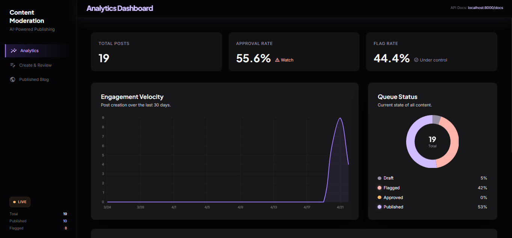
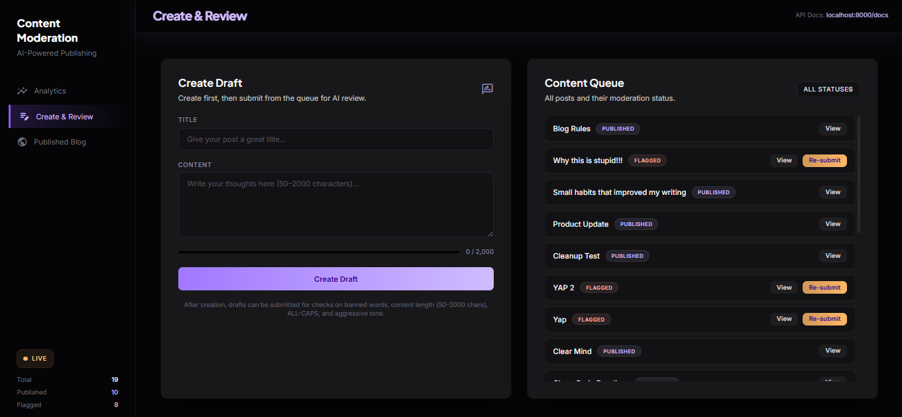
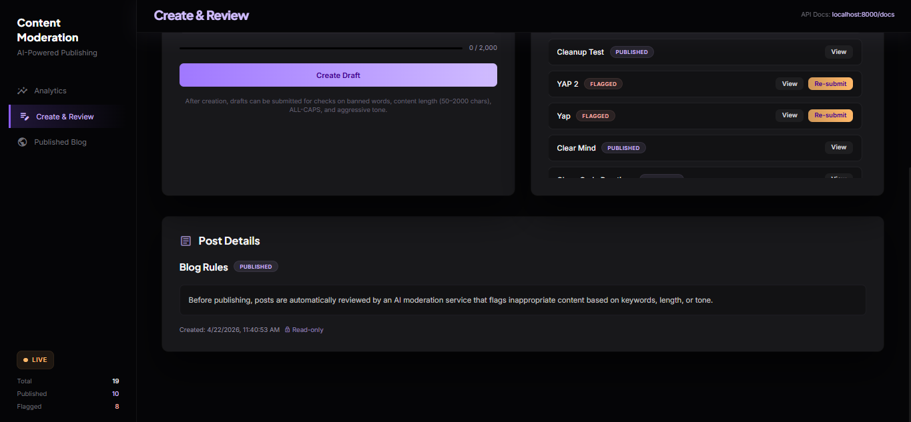
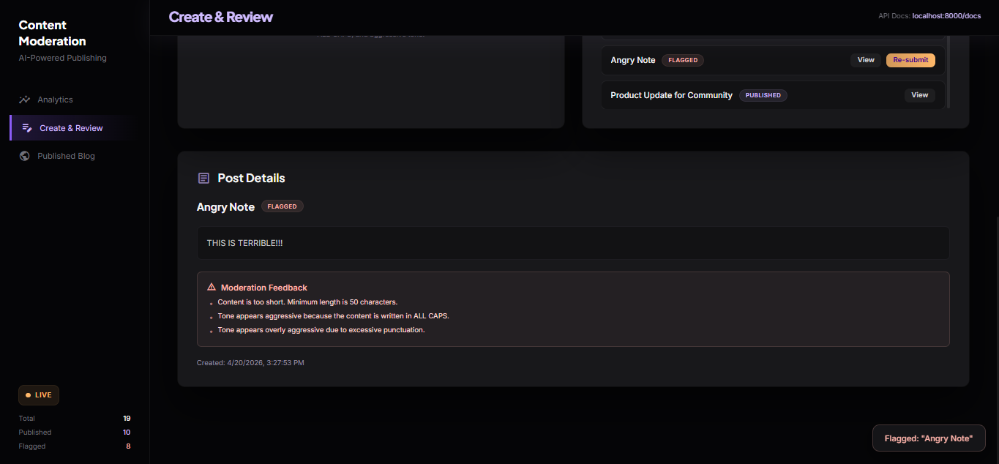
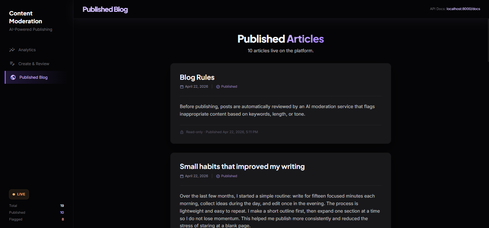
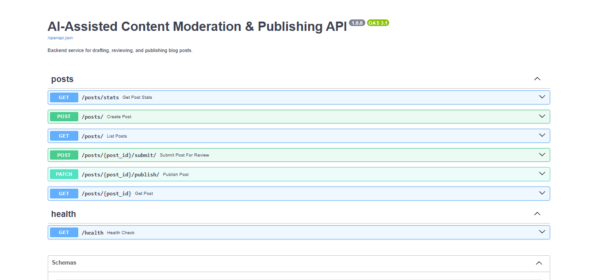

# AI-Assisted Content Moderation & Publishing Platform

Full-stack assessment project for drafting short posts, submitting them to moderation, and publishing approved content.

## What This Project Demonstrates

- FastAPI backend with clear business rules for moderation and publishing
- SQLite persistence managed through Alembic migrations
- React frontend that uses API calls only
- Auto-generated Python SDK from OpenAPI
- One-command setup and run flow for Windows
- Automated CI checks, including OpenAPI drift verification

## Demo

### Video Walkthrough

- Full demo video: [Add your Loom/YouTube/Drive link here](https://example.com)

### Screenshots

(media/dashboard.png)






## Tech Stack

- Backend: FastAPI, SQLAlchemy, Alembic, SQLite
- Frontend: React + Vite, Axios, React Router, Chart.js
- Real-time: WebSockets
- Testing: pytest + FastAPI TestClient
- SDK: OpenAPI Generator (Python client)

## Prerequisites

- Python 3.11+
- Node.js 18+ and npm
- Windows PowerShell or Command Prompt for .bat scripts

## Project Layout

```
.
├── backend/                 # FastAPI app and Alembic migrations
├── frontend/                # React app
├── moderation_sdk/          # Generated Python SDK
├── scripts/                 # Utility scripts (seed data)
├── tests/                   # Backend tests
├── setupdev.bat             # One-time setup (dependencies + migrations)
├── runapplication.bat       # Starts backend and frontend
├── generate_sdk.bat         # Regenerates Python SDK
├── dump_openapi.py          # Regenerates openapi.json from FastAPI
├── openapi.json             # OpenAPI snapshot committed to repo
├── alembic.ini              # Alembic config
└── requirements.txt         # Backend dependencies
```

## Quick Start (Windows)

1. Set up dependencies and migrate DB

```bat
setupdev.bat
```

2. Run backend and frontend

```bat
runapplication.bat
```

Endpoints after startup:
- Backend API: http://localhost:8000
- Swagger docs: http://localhost:8000/docs
- Frontend UI: http://localhost:5173

What setupdev.bat does:
- Uses existing env or .venv when available
- Creates env if no virtual environment exists
- Installs backend dependencies from requirements.txt
- Runs alembic upgrade head
- Installs frontend dependencies in frontend/

## Manual Setup (Any OS)

### Backend

```bash
python -m venv env
```

Activate virtual environment:

```powershell
env\Scripts\activate
```

```bash
source env/bin/activate
```

Install and migrate:

```bash
python -m pip install --upgrade pip
pip install -r requirements.txt
alembic upgrade head
```

Run backend:

```bash
uvicorn backend.app.main:app --reload --host 0.0.0.0 --port 8000
```

### Frontend

```bash
cd frontend
npm install
npm run dev
```

## API Summary

- POST /posts/ -> create draft
- POST /posts/{id}/submit/ -> run moderation review
- PATCH /posts/{id}/publish/ -> publish approved post
- GET /posts/ -> list posts with filters
- GET /posts/{id} -> fetch single post
- GET /posts/stats -> analytics data for dashboard
- WS /ws -> real-time events
- GET /health -> health check

## Moderation and Publishing Rules

The moderation flow enforces:
- Content length bounds
- Banned words
- Aggressive tone signals (including all-caps and punctuation patterns)
- Explicit feedback reasons when flagged

Publishing flow enforces:
- Only approved posts can be published
- Published posts are immutable

Environment variables supported:
- MIN_CONTENT_LENGTH (default: 50)
- MAX_CONTENT_LENGTH (default: 2000)
- BANNED_WORDS (comma-separated)
- AGGRESSIVE_KEYWORDS (comma-separated)

## Run Tests

```bash
pytest -q tests
```

Windows direct executable example:

```powershell
env\Scripts\python.exe -m pytest -q tests
```

## Generate SDK

One-command path:

```bat
generate_sdk.bat
```

This command:
1. Regenerates openapi.json via dump_openapi.py
2. Generates the Python client in moderation_sdk/

Equivalent generator command:

```bash
openapi-generator-cli generate -i openapi.json -g python -o moderation_sdk --additional-properties=packageName=moderation_sdk
```

## Seed Data

Sample SQL seed file:
- scripts/seed_data.sql

## CI Notes

GitHub Actions workflow:
- .github/workflows/ci.yml

CI validates:
- Backend tests
- Frontend build
- OpenAPI spec drift (dump_openapi.py must not change openapi.json unexpectedly)

## Troubleshooting

- Backend virtual environment not found when running runapplication.bat
  - Run setupdev.bat first.

- Browser warning: WebSocket is closed before the connection is established
  - In development, React StrictMode can trigger an extra mount/unmount cycle. If backend logs show /ws accepted, the socket is working.

- Browser warning: cdn.tailwindcss.com should not be used in production
  - Expected for this development setup because frontend/index.html currently uses the Tailwind CDN.